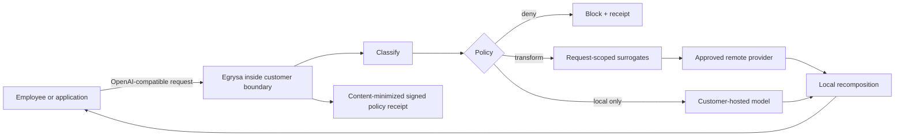

# Egrysa

Open-source, customer-owned AI egress control. Egrysa sits between enterprise users and model
providers, removes or blocks high-risk data, routes confidential work locally, and returns a signed,
content-minimized policy receipt without storing prompt content.

**Status:** security-oriented MVP, not a certified product. It is suitable for technical evaluation
in a non-production environment. It does not make an organization compliant, guarantee that every
sensitive value will be detected, or prove that a provider deleted data.

## The boundary



Egrysa controls the request before provider egress, provider selection, request fields, local
recomposition, and local audit evidence. It cannot control a provider's internal safety systems,
legal holds, infrastructure telemetry, weights, or contractual behavior. Provider retention and
training settings are policy inputs that must be validated through contract and configuration.

## Demonstrated in this repository

- OpenAI-compatible `POST /v1/chat/completions` ingress and `GET /v1/models` discovery.
- SSE streaming for OpenAI-compatible providers with bounded holdback recomposition.
- Function-tool definitions, assistant tool calls, and tool results as inspected text surfaces;
  Egrysa does not execute tools.
- Deterministic detection for emails, phones, IP addresses, IBANs, payment cards, hyphenated US
  SSNs, private keys, common API secrets, and configured confidential terms.
- Four decisions: `deny`, `local_only`, `transform`, and explicitly approved `allow_raw`.
- Request-scoped, consistent surrogate replacement and local response recomposition.
- OpenAI, Anthropic, and local OpenAI-compatible provider adapters.
- Model allowlists, HTTPS enforcement, loopback-only HTTP, upstream deadlines, request-size limits,
  and no redirects.
- `store: false` forced on OpenAI-compatible remote requests.
- Append-only JSONL, Ed25519-signed, hash-chained policy receipts with workload attribution, a keyed
  nonce-bound request fingerprint, public verification material, and no raw prompt or response.
- No raw prompt or response logging.
- Deno capability sandbox, no subprocess/FFI permission, and zero third-party runtime packages.
- Hardened Kubernetes baseline, immutable CI actions, CodeQL, dependency review, SBOM, and SLSA
  provenance configuration.

## Deliberate exclusions

- Anthropic-adapter streaming remains unsupported and fails closed.
- Function tools are passed through but never executed. Sensitive structural schema keys fail
  closed.
- No files, audio, or images: each creates a separate egress and injection boundary.
- No cross-provider prompt splitting: it increases the number of recipients and can destroy
  semantics. It requires an evidence-backed decomposition protocol before release.
- No durable prompt memory. The surrogate map exists only for the request lifetime.
- No claim that a natural-language “forget” instruction changes provider retention. Contractual
  controls and supported API parameters are used instead.
- No transparent employee identity header is forwarded to providers.
- Contiguous nine-digit values are not classified as SSNs. Deny-class SSN detection requires the
  canonical hyphenated form to avoid blocking ordinary identifiers.

## Why open source first

The trust boundary must be inspectable. The community edition is the reference data plane: policy,
classification, transformation, routing, and receipts run inside infrastructure the operator owns.
The project will compete first on transparency, deployment speed, a small attack surface, and
reproducible evidence—not on a closed control plane that requires customers to surrender prompts.

Potential paid enterprise work belongs above this boundary: identity and tenant administration,
durable evidence export, HSM/KMS integration, support, certified release processes, and deployment
assurance. It must not depend on observing customer prompt content.

## Local evaluation

Requirements: Deno 2.9.2. The repository has no external code dependencies.

1. Generate an attributed client key, a 32-byte fingerprint key, and a matching Ed25519 keypair:

   ```sh
   deno task keygen > .env.local
   ```

   To avoid shell redirection, run `deno run --allow-write=.env.local tools/keygen.ts .env.local`.

   The generated local-only file contains:

   ```text
   EGRYSA_INBOUND_KEYS=example-workload=<client bearer key>
   EGRYSA_RECEIPT_FINGERPRINT_KEY=<request-fingerprint key>
   EGRYSA_RECEIPT_ED25519_PRIVATE_KEY=<base64 PKCS8 private key>
   EGRYSA_RECEIPT_ED25519_PUBLIC_KEY=<base64 SPKI public key>
   ```

2. Keep provider keys in `.env.local`; never put them in JSON or Git.
3. Review `config/egrysa.example.json`. Remote raw egress is disabled by default. Configure a local
   model or explicitly approve clean raw egress only after the provider contract is reviewed.
4. Run:

   ```sh
   deno task check
   deno task eval
   deno task acceptance
   deno task dev
   ```

5. Call the gateway with the client key:

   ```sh
   curl http://127.0.0.1:8787/v1/chat/completions \
     -H "Authorization: Bearer $EGRYSA_CLIENT_KEY" \
     -H "Content-Type: application/json" \
     -d '{"model":"gpt-5.2","messages":[{"role":"user","content":"Email alex@example.com with a two-line summary."}]}'
   ```

The response headers contain `x-egrysa-decision` and `x-egrysa-receipt`. The public verification key
and an externally storable signed chain checkpoint are available at `/v1/receipts/public-key` and
`/v1/receipts/checkpoint` with gateway authentication.

## Read first

- [CISO brief](docs/CISO_BRIEF.md)
- [Architecture and control points](docs/ARCHITECTURE.md)
- [Threat model](docs/THREAT_MODEL.md)
- [Control mapping](docs/COMPLIANCE.md)
- [Evaluation record](docs/EVALUATION.md)
- [Release-image SBOM advisory triage](docs/SBOM_TRIAGE.md)
- [Research roadmap](docs/RESEARCH_ROADMAP.md)
- [Preliminary naming screen](docs/NAMING.md)
- [Public-readiness review](docs/PUBLIC_READINESS.md)
- [Hardening milestones](docs/HARDENING_MILESTONES.md)
- [Open-source-first strategy](docs/OPEN_SOURCE_STRATEGY.md)
- [Operations and deployment](docs/OPERATIONS.md)
- [Security policy](SECURITY.md)
- [Roadmap](ROADMAP.md)
- [Governance](GOVERNANCE.md)
- [Support](SUPPORT.md)
- [Release process](docs/RELEASE.md)

Apache-2.0 licensed. Egrysa is the selected product name. The repository records that external legal
screening was reported complete; it does not itself make a trademark-clearance claim.
