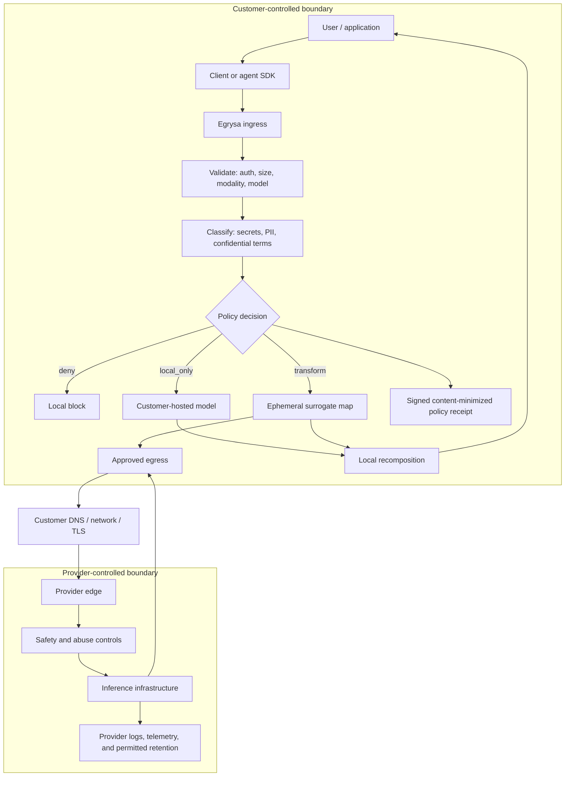

# Architecture and control points

## End-to-end AI data path

## Control matrix

| Point            | Customer control                           | Egrysa control                                                         | Not controlled here                                             |
| ---------------- | ------------------------------------------ | ---------------------------------------------------------------------- | --------------------------------------------------------------- |
| User input       | Endpoint, identity, acceptable-use policy  | API authentication and supported shape                                 | Copy/paste before the gateway                                   |
| Pre-egress       | Network placement and taxonomy             | classify, deny, transform, route                                       | Unknown entities outside the taxonomy                           |
| Egress           | DNS, firewall, proxy, private connectivity | fixed provider URL, HTTPS, no redirect, model allowlist                | Public internet routing and provider edge                       |
| Provider request | Contract, project, region, entitlements    | strips unsupported fields; forces `store:false` for OpenAI-style calls | Provider safety review, legal holds, metadata, internal systems |
| Inference        | provider/model choice                      | approved provider and model only                                       | weights, caches, internal routing, model behavior               |
| Response         | application UX                             | buffered recomposition and content-minimized receipt                   | Provider-generated sensitive text not tied to a surrogate       |
| Memory           | customer architecture                      | none in v0.1                                                           | Any external application or provider conversation state         |

## Data invariants

- Surrogate maps are request-scoped `Map` objects and are not passed to logging, receipt, or
  persistence code.
- Receipts contain a keyed, nonce-bound request fingerprint, finding counts, decision,
  provider/model identifiers, and chain/signature values only. They contain no raw prompt or
  response content.
- Provider credentials are read from named environment variables and never accepted in request
  bodies.
- Remote providers require HTTPS; plaintext HTTP is limited to loopback providers explicitly marked
  local.
- OpenAI-compatible upstream payloads use an allowlist of fields, force non-streaming, and force
  `store:false`.
- Tool calls and multimodal content are rejected before classification.

## Known engineering limits

Deno/JavaScript strings are garbage-collected and cannot be deterministically zeroized. A
process-memory or host compromise can recover request content. Production should combine short
request lifetime, swap restrictions, encrypted nodes, process isolation, memory limits, crash-dump
controls, and an external security review. A future hardened data plane may use a memory-safe native
implementation with explicit secret-buffer handling, but that does not remove plaintext from active
process memory.
