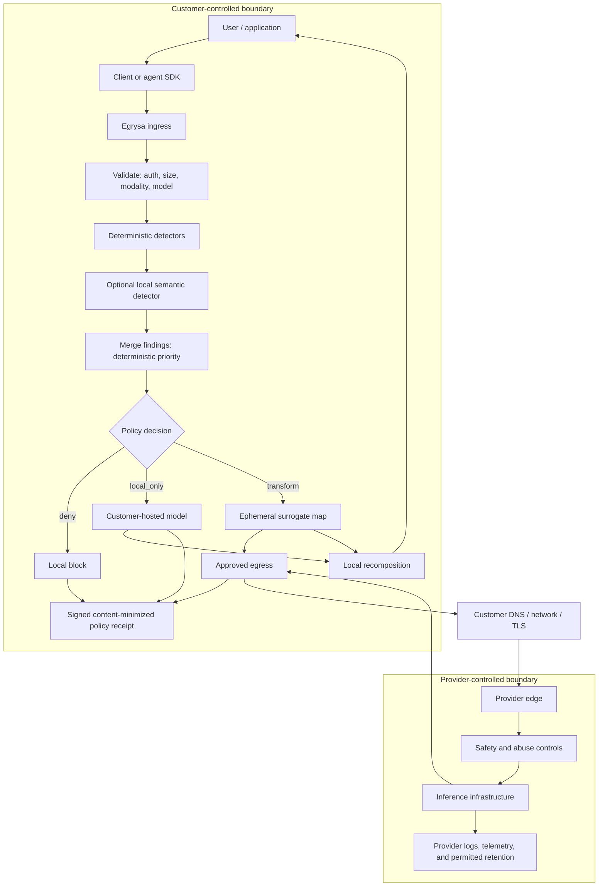

# Architecture and control points

## End-to-end AI data path

## Control matrix

| Point            | Customer control                           | Egrysa control                                                         | Not controlled here                                             |
| ---------------- | ------------------------------------------ | ---------------------------------------------------------------------- | --------------------------------------------------------------- |
| User input       | Endpoint, identity, acceptable-use policy  | API authentication and supported shape                                 | Copy/paste before the gateway                                   |
| Pre-egress       | Network placement and taxonomy             | deterministic classify; optional local semantic candidates; policy     | Unknown entities and semantic model misses                      |
| Egress           | DNS, firewall, proxy, private connectivity | fixed provider URL, HTTPS, no redirect, model allowlist                | Public internet routing and provider edge                       |
| Provider request | Contract, project, region, entitlements    | strips unsupported fields; forces `store:false` for OpenAI-style calls | Provider safety review, legal holds, metadata, internal systems |
| Inference        | provider/model choice                      | approved provider and model only                                       | weights, caches, internal routing, model behavior               |
| Response         | application UX                             | buffered or SSE holdback recomposition and minimized receipt           | Provider-generated sensitive text not tied to a surrogate       |
| Evidence         | storage, external checkpoint retention     | durable single-writer JSONL chain and Ed25519 signatures               | A signer with the private key can rewrite unanchored history    |
| Memory           | customer architecture                      | none in the gateway                                                    | Any external application or provider conversation state         |

## Data invariants

- Surrogate maps are request-scoped `Map` objects and are not passed to logging, receipt, or
  persistence code.
- Receipts contain workload attribution, a keyed nonce-bound request fingerprint, finding counts,
  decision, provider/model identifiers, and chain/signature values only. They contain no raw prompt
  or response content.
- Denials retain version-2/version-3 policy receipts. Provider attempts use version-4 receipts:
  non-streaming success records `egress:completed`, invocation failure records `egress:failed`, and
  streaming records `egress:started` after upstream response headers arrive. Stream completion
  attestation is not claimed.
- When semantic detection is enabled, receipts add only detector IDs/versions and a degradation
  boolean. No receipt records finding text or request/response content.
- Provider credentials are read from named environment variables and never accepted in request
  bodies.
- Remote providers require HTTPS; plaintext HTTP is limited to loopback providers explicitly marked
  local.
- OpenAI-compatible upstream payloads use an allowlist of fields and force `store:false`.
- Streaming SSE content and tool-call argument fragments use bounded local recomposition. Anthropic
  streaming and multimodal content fail closed.
- Recomposition treats token-shaped, case-insensitive `EGRYSA_...` fragments as suspected damage
  even when a provider removes all leading underscores. This intentionally favors failing closed;
  ordinary prose such as “Egrysa is a gateway” lacks the separator/body shape and is not residue.
- Function definitions, message content, tool-call arguments, tool results, and JSON-schema string
  values are inspected. Sensitive structural schema keys cannot be transformed and are denied.
- Semantic detector inputs use only a configured loopback provider marked `local:true`; redirects
  are disabled, responses are bounded, model offsets are ignored, and candidates must occur
  literally in the inspected source. Deterministic findings win every overlap.
- Semantic findings are low precision. High-precision deterministic findings remain the only
  finding-based path to a hard deny; low-precision candidates transform or route locally.

## Known engineering limits

Deno/JavaScript strings are garbage-collected and cannot be deterministically zeroized. A
process-memory or host compromise can recover request content. Production should combine short
request lifetime, swap restrictions, encrypted nodes, process isolation, memory limits, crash-dump
controls, and an external security review. A future hardened data plane may use a memory-safe native
implementation with explicit secret-buffer handling, but that does not remove plaintext from active
process memory.

The reference semantic detector is probabilistic, model-dependent, and best-effort. It can miss
entities, hallucinate literal substrings, be evaded by obfuscation, or add seconds of latency. Its
failure policy is explicit: `degrade` discards semantic findings for the request and continues with
the deterministic floor, while `deny` stops the request for higher-assurance deployments.
